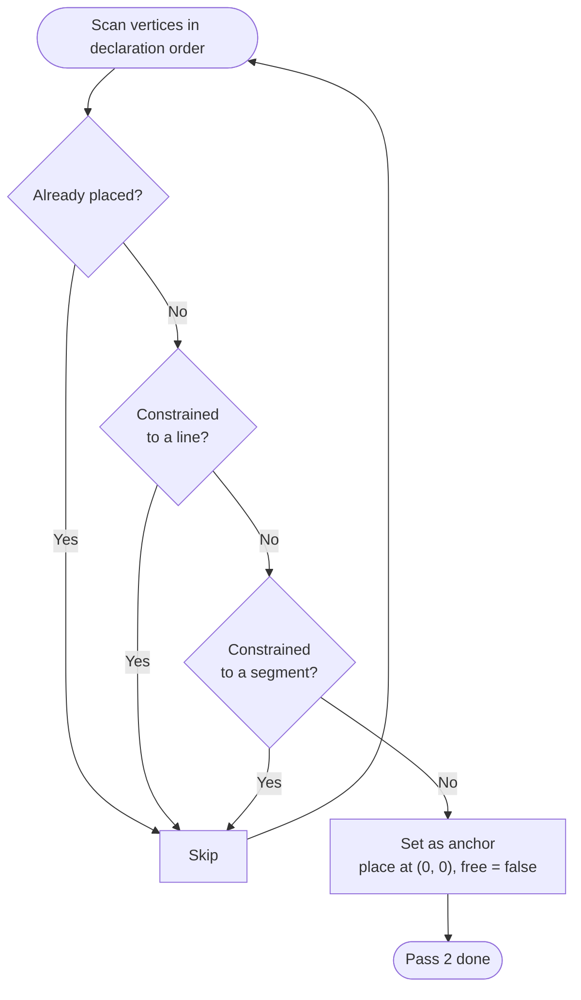

# Pass 2 — Anchor Selection

Tilde describes geometry in relative terms: "a triangle with sides 3, 4, 5". That description says nothing about *where* the triangle sits in the plane. Before placement can begin, the solver needs one fixed point to act as the coordinate origin — the **anchor**.

## How the anchor is chosen

The solver scans vertices in declaration order and picks the first one that is:

- **not already placed** — explicitly-positioned points (e.g. `let point a at 1 2`) are already fixed and skipped
- **not on a named line** — a vertex on a line will be placed *by* the line constraint, not by being pinned at the origin
- **not on a segment** — similarly, a vertex on a segment gets its position from that segment

The first vertex that passes all three checks becomes the anchor. It is fixed at **(0, 0)** and marked as determined (not free).

## Why (0, 0)?

The anchor's absolute position is arbitrary — the geometry only cares about relative distances and angles. Placing it at the origin is a simple, consistent convention. Every other vertex will be placed relative to this point by Pass 3.

## Why not just pick the first declared vertex?

If the first vertex were constrained to lie on a specific line, pinning it at the origin would force the origin to be on that line, which may conflict with other constraints. Skipping constrained vertices lets the anchor be a genuinely free vertex that can live wherever the solver needs it.

## Orientation

Fixing the anchor removes the *translation* degree of freedom — the figure can no longer slide around the plane. But rotation is still free at this point. The first time Pass 3 places a vertex using only a single known distance (no second anchor to triangulate from), it fixes the orientation by placing that vertex along the +x axis. From then on, the figure's rotation in the plane is also fixed.

See [Pass 3 — Placement](./placement) for the full details.
