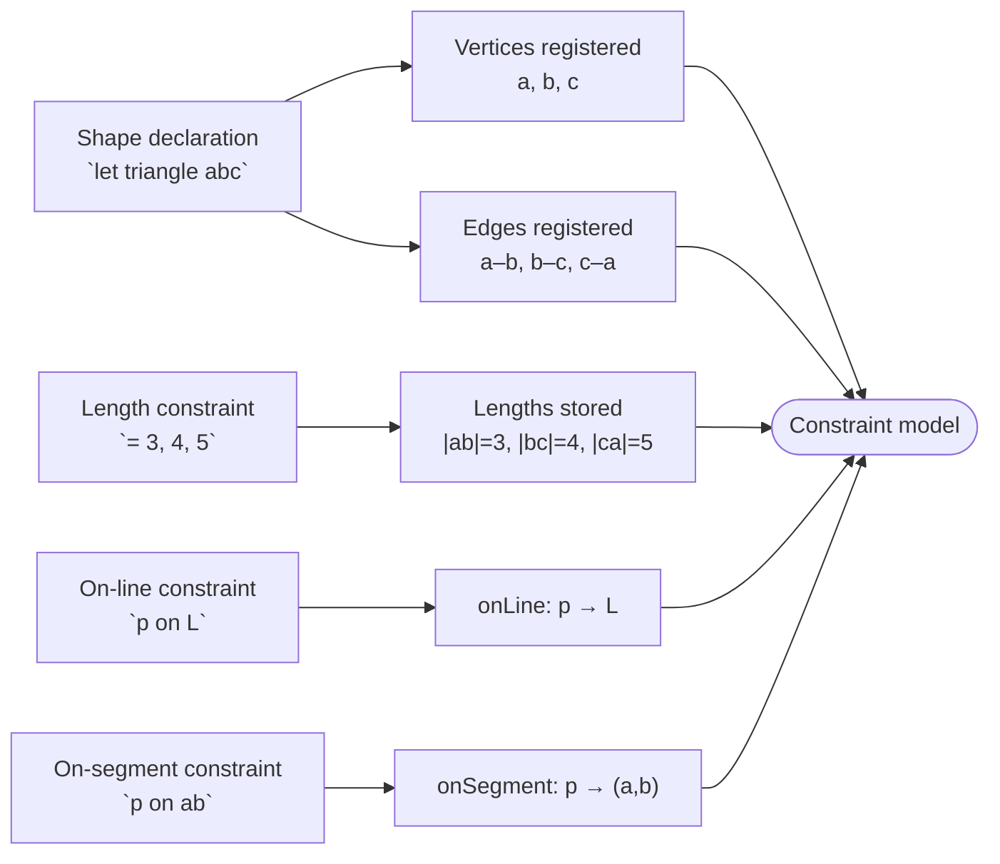

# Pass 1 — Constraint Model

Pass 1 walks every statement in the program and builds the **constraint model** — a graph of vertices and the relationships between them. This is the data structure Pass 3 works from when placing vertices.

## What gets built

By the end of Pass 1, the model holds:

| Structure | What it stores |
|---|---|
| `points` | Every declared vertex, initially unplaced (`free = true`) |
| `segments` | The set of all declared edges, as canonical pairs |
| `lengths` | A length value for each segment that has one, or nothing |
| `lines` | Named lines, each stored as `ax + by + c = 0` |
| `onLine` | Which vertex is constrained to which named line |
| `onSegment` | Which vertex is constrained to lie on which segment |
| `solutionPicks` | Which solution index was chosen for each ambiguous vertex |

## How shapes become vertices and edges

A shape declaration registers its vertices and the edges between them. No positions are assigned yet — that's Pass 3's job.

```
let triangle abc
```

This registers vertices `a`, `b`, `c` and three edges: `a–b`, `b–c`, `c–a`.

```
let segment ab
```

Registers vertices `a`, `b` and one edge: `a–b`.

Inline length constraints attach a length value to the edge at the same time:

```
let triangle abc = 3, 4, 5
```

Registers the triangle and sets `|ab| = 3`, `|bc| = 4`, `|ca| = 5`.

## How constraints layer on top

Constraints declared separately (via `with` blocks or standalone statements) add information to what's already registered. A `length` constraint sets a length on an existing or new edge. An `on-line` or `on-segment` constraint records that a vertex must lie on a specific line or segment.



## Pick statements

`pick v 2` tells the solver that when vertex `v` has two possible positions, it should use position 2. These are recorded during Pass 1 and consulted during placement in Pass 3.

## What Pass 1 does not do

Pass 1 does **not** assign coordinates to any vertex. Every vertex enters Pass 3 as an unplaced point — `(0, 0, free = true)` by default. The constraint model is purely relational: it says *what exists* and *what constraints apply*, not *where anything is*.
