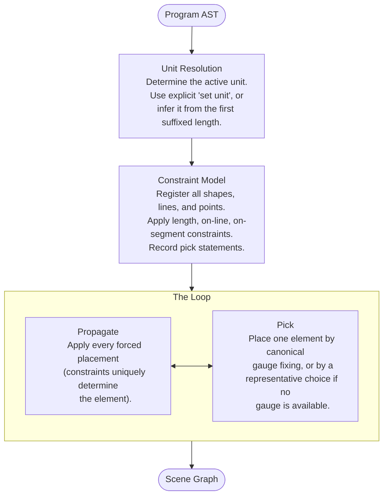

# Solver

Tilde's solver works the way a human does when solving a geometry problem by hand: start from what you know, apply a construction, find a new point, repeat. Each vertex is placed by intersecting circles, lines, or both — exact constructions, not approximations. A triangle with sides 3, 4, 5 always produces a right angle of exactly 90°.

This also means the solver fails loudly when constraints are inconsistent, rather than silently producing a nonsensical result.

## The solver flow

Every time you edit a program, the solver runs three stages in sequence. The middle stage is a loop that keeps placing elements until nothing else can be placed.

After the constraint model is built, the loop alternates between two halves:

- **Propagate** scans for placements that the constraints uniquely determine — a vertex on two known lines (the intersection), a line through two placed points, etc. Every forced placement fires until none are left.
- **Pick** places a single element when nothing is forced — either by claiming a still-free degree of freedom and placing canonically (origin, +x direction, unit scale), or by choosing a representative position along a free locus.

The loop runs until neither phase fires. Whatever's left in the model becomes the scene graph.

## Pages

- [Unit Resolution](./unit-resolution) — how Tilde decides what a bare number means
- [Constraint Model](./constraint-model) — the graph of vertices, lengths, and relationships the solver works from
- [Anchor](./anchor) — degrees of freedom and how the solver picks a canonical position when one is free
- [Placement](./placement) — the propagate/pick loop and the rules that place each vertex and complete each line
- [Types](./types) — the working types, output types, and helpers used throughout the solver
