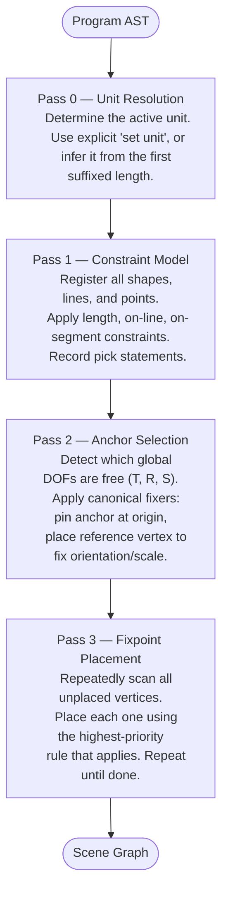

# Solver

Tilde's solver works the way a human does when solving a geometry problem by hand: start from what you know, apply a construction, find a new point, repeat. Each vertex is placed by intersecting circles, lines, or both — exact constructions, not approximations. A triangle with sides 3, 4, 5 always produces a right angle of exactly 90°.

This also means the solver fails loudly when constraints are inconsistent, rather than silently producing a nonsensical result.

## The four passes

Every time you edit a program, the solver runs four passes in sequence:

## Pages

- [Pass 0 — Unit Resolution](./unit-resolution) — how Tilde decides what a bare number means
- [Pass 1 — Constraint Model](./constraint-model) — the graph of vertices, lengths, and relationships the solver works from
- [Pass 2 — Anchor](./anchor) — DOF detection and canonical fixers for translation, rotation, and scale
- [Pass 3 — Placement](./placement) — the core fixpoint loop that places every vertex and completes every line
- [Types](./types) — the working types, output types, and helpers used throughout the solver
