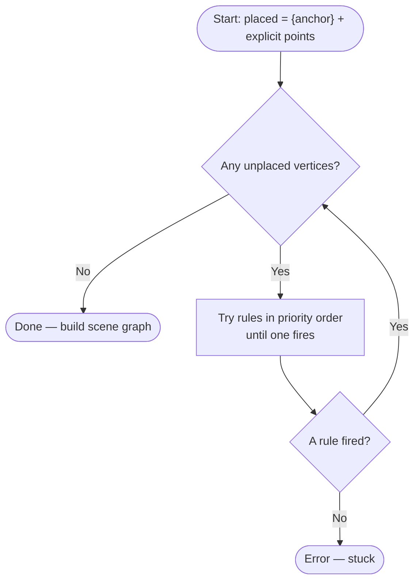
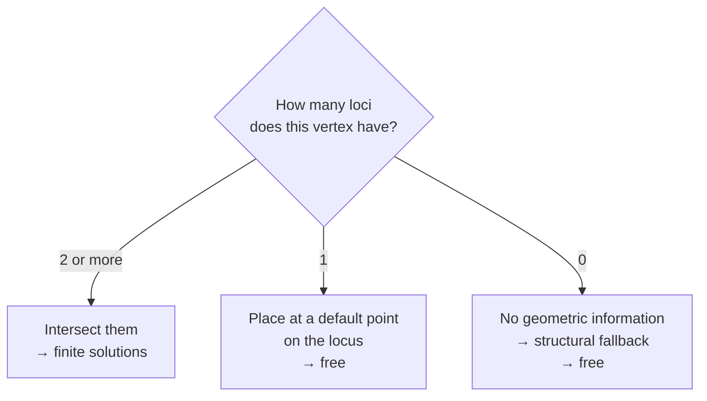

# Pass 3 — Fixpoint Placement

Pass 3 is the core of the solver. It takes the constraint model from Pass 1 and the anchor from Pass 2, and places every remaining vertex by repeatedly applying geometric rules until nothing is left to do.

## The fixpoint loop

Scan all unplaced vertices, find one that can be placed, place it, then scan again. Repeat until every vertex has a position.



The loop is guaranteed to terminate: every iteration either places at least one vertex or exits. Stuck states cannot occur in practice because the 0-loci fallbacks handle everything, including completely isolated vertices.

## How placement works

Every constraint on a vertex defines a **locus** — the set of positions where that vertex could legally sit.

| Constraint | Locus |
|---|---|
| Known distance from a placed point | Circle |
| On a named line | Line |
| On a segment (both endpoints placed) | Line segment |

The solver collects all available loci for a vertex and intersects them. The number of loci determines how constrained the placement is.



Rules are tried in priority order — highest locus count first — so a vertex is always placed as precisely as the available constraints allow.

---

## 2+ loci — Fully determined

Two or more loci intersect at a finite number of points (usually 1 or 2). The vertex is placed exactly.

### a. Circle ∩ Circle

**Condition:** two or more placed neighbors each connected by a known distance.

Each known distance draws a circle around its placed neighbor. The vertex lies at the intersection of those circles.

```
      a ·····
       ·     ·····
        ·          ·
   r₁   ·      s₁ ×  ← solution 1 (left of a→b)
         ·    ×
          ·  s₂     ← solution 2 (right of a→b)
           ·
            b ·····
```

Given placed points `a` and `b` at distance `d`, with radii `r₁` and `r₂`:

1. Distance along `a→b` to the radical axis: `A = (r₁² − r₂² + d²) / 2d`
2. Perpendicular offset: `h = √(r₁² − A²)`
3. Solutions: `m ± h·n̂` where `m` is the point along `ab` at distance `A` from `a`, and `n̂` is the unit normal to `ab`

Solution 1 is left of `a→b` (counter-clockwise). Solution 2 is right (clockwise).

### b. Circle ∩ Line

**Condition:** vertex is on a named line, and has at least one placed neighbor with a known distance.

The named line and the distance circle intersect at up to two points.

Given placed neighbor `p` at distance `r`, and line `ax + by + c = 0`:

1. Project `p` onto the line → foot `f`
2. Distance from `p` to line: `d = |ap_x + bp_y + c| / √(a² + b²)`
3. Offset along the line: `h = √(r² − d²)`
4. Solutions: `f ± h·t̂` where `t̂` is the unit tangent of the line

Solution 1 has the higher y-coordinate (or larger x if y values are equal).

**Both rules:** if the two loci are tangent, there is exactly one solution. If they do not reach each other, the solver throws a constraint error.

---

## 1 locus — Underconstrained

Only one locus is available. The vertex is free to slide along it — its position is not uniquely determined. The solver picks a default point and marks the vertex **free**.

### a. Circle

**Condition:** exactly one placed neighbor with a known distance, no other loci.

The vertex lies somewhere on the circle around that neighbor, but the angle is unconstrained. The solver uses a **rotating heading**: starts along +x, then rotates 90° counter-clockwise after each such placement (+x → +y → −x → −y → repeat).

The rotation prevents degenerate layouts where everything collapses onto a line. A rhombus with only side lengths would place all four vertices in a row without it; the rotation produces a square-like layout instead.

**Orientation fixing:** the very first placement of this kind is treated specially — it establishes the global orientation of the figure. That vertex is marked as determined (not free). All subsequent placements on a circle are marked free.

### b. Line

**Condition:** vertex is constrained to a named line, no distance neighbors yet.

The vertex lies somewhere on the line. The solver places it at the **foot of the perpendicular from the origin** to the line — the closest point on the line to (0, 0). Marked free.

### c. Segment

**Condition:** vertex is constrained to a segment, and both endpoints of that segment are placed.

The vertex lies somewhere along the segment. If multiple vertices share the same segment, they are distributed evenly:

```
a ──── p₁ ──── p₂ ──── p₃ ──── b
       t=¼     t=½     t=¾
```

For `n` unplaced vertices, vertex `i` is placed at `t = (i+1) / (n+1)`. All are marked free.

---

## 0 loci — No geometric information

No locus is available. The solver cannot reason geometrically about this vertex yet. It places it structurally — just enough to make the figure visible — and marks it **free**.

### a. Segment neighbor

**Condition:** the vertex shares a segment with a placed neighbor, but the length is unknown (so no circle).

Placed 3 units along +x from that neighbor as a placeholder.

### b. Isolated

**Condition:** no connection to any placed vertex at all.

Isolated vertices belong to a disconnected component of the constraint graph. They are seeded one at a time, stacked vertically below the main figure so they do not overlap. Each seeded vertex then allows its neighbors to be reached in the next loop iteration.

---

## Free propagation

The `free` flag controls rendering: a free vertex gets a wavy circle and squiggly edges; a determined vertex gets a crisp dot and solid lines.

`free` propagates through the constraint graph: when a vertex is placed by intersecting loci, it inherits `free` from the loci that determined it. If a placed neighbor was free, the new vertex is free too — its position is only determined relative to something that was already moving.

Vertices placed by 1-locus or 0-loci rules are always free.

---

## Multiple solutions and pick

When two loci intersect at two distinct points and no `pick` has been declared, both positions are stored and shown on the canvas, numbered 1 and 2. Edges connected to an ambiguous vertex are drawn for every combination.

```
pick v 1   ← use solution 1
pick v 2   ← use solution 2
```

A picked vertex is treated as determined from that point forward. Its `free` status then depends only on whether its loci were free.
