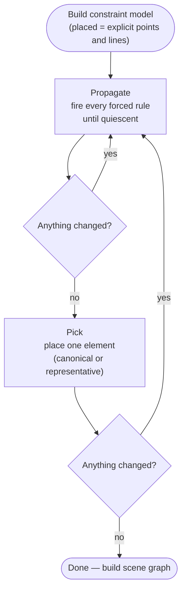

# Placement

The heart of the solver is a loop with two halves: **propagate** finds every placement that the constraints uniquely determine, and **pick** places one element when nothing is forced. They alternate until both are quiescent.

## The loop



A pick can unlock more propagation: placing one vertex by a canonical fixer may give another vertex a second known neighbour, which then resolves exactly via propagate. The loop is guaranteed to terminate — every iteration either places an element or exits.

## Propagate — forced placements

A placement is **forced** when the constraints uniquely determine the element. No canonical choice, no representative pick. Every forced rule fires in priority order until nothing more can be placed.

Every constraint on a vertex defines a **locus** — the set of positions where that vertex could legally sit.

| Constraint | Locus |
|---|---|
| Known distance from a placed point | Circle |
| On a named line | Line |
| On a segment (both endpoints placed) | Line segment |

A vertex with two or more loci is placed at their intersection (finite solutions, `dof = 0`). Lines work the same way — a line with a placed point and a known coefficient pair is exactly determined.

### 1. Line ∩ Line

**Condition:** vertex is constrained to two or more named lines.

Two lines in general position intersect at exactly one point — no placed neighbours are needed. This fires before the circle variants.

Given lines `a₁x + b₁y + c₁ = 0` and `a₂x + b₂y + c₂ = 0`, the intersection is found via Cramer's rule:

```
x = (b₁c₂ − b₂c₁) / det
y = (a₂c₁ − a₁c₂) / det
where det = a₁b₂ − a₂b₁
```

If `det ≈ 0` the lines are parallel and the solver throws a constraint error.

When three or more lines are specified, the solver intersects the first two to get a candidate point, then verifies that the candidate satisfies every remaining line equation. If any line does not pass through that point, the constraints are inconsistent and the solver throws.

### 2. Circle ∩ Circle

**Condition:** two or more placed neighbours each connected by a known distance.

Each known distance draws a circle around its placed neighbour. The vertex lies at the intersection of those circles.

```
      a ·····
       ·     ·····
        ·          ·
   r₁   ·      s₁ ×  ← solution 1 (left of a→b)
         ·    ×
          ·  s₂     ← solution 2 (right of a→b)
           ·
            b ·····
```

Given placed points `a` and `b` at distance `d`, with radii `r₁` and `r₂`:

1. Distance along `a→b` to the radical axis: `A = (r₁² − r₂² + d²) / 2d`
2. Perpendicular offset: `h = √(r₁² − A²)`
3. Solutions: `m ± h·n̂` where `m` is the point along `ab` at distance `A` from `a`, and `n̂` is the unit normal to `ab`

Solution 1 is left of `a→b` (counter-clockwise). Solution 2 is right (clockwise).

### 3. Circle ∩ Line

**Condition:** vertex is on a named line, and has at least one placed neighbour with a known distance.

The named line and the distance circle intersect at up to two points.

Given placed neighbour `p` at distance `r`, and line `ax + by + c = 0`:

1. Project `p` onto the line → foot `f`
2. Distance from `p` to line: `d = |ap_x + bp_y + c| / √(a² + b²)`
3. Offset along the line: `h = √(r² − d²)`
4. Solutions: `f ± h·t̂` where `t̂` is the unit tangent of the line

Solution 1 has the higher y-coordinate (or larger x if y values are equal).

**Both circle rules:** if the two loci are tangent, there is exactly one solution. If they do not reach each other, the solver throws a constraint error.

### 4. Line completion

**Condition:** a named line has placed points on it.

If two or more distinct placed points are on the line, both direction and position are determined. If one placed point plus a known coefficient pair are on the line, the missing coefficient is solved exactly.

### 5. Direction propagation

**Condition:** a line is declared parallel or perpendicular to another line whose direction is already known.

The direction of the partner copies over. If `parallel at d` is specified and the partner is fully resolved, position is determined too (two solutions, one on each side).

---

## Pick — one element at a time

When propagate stops firing but the model still has unplaced elements, pick takes over. Each pick call places **one** element, then propagate runs again to chase the consequences.

A pick has two sub-cases:

1. **Canonical** — a global degree of freedom (T, R, or S) is still free. Consuming it places the element at a canonical position (`dof = 0`). This is the [anchor](./anchor) machinery.
2. **Representative** — no gauge is available. The element is placed at a representative position along its free locus, marked as underconstrained (`dof > 0`).

### Representative — locus

**1 placed neighbour with a known distance.** The vertex lies somewhere on the circle around that neighbour, but the angle is unconstrained. The solver uses a **rotating heading**: starts along +x, then rotates 90° counter-clockwise after each such placement (+x → +y → −x → −y → repeat).

The rotation prevents degenerate layouts where everything collapses onto a line. A rhombus with only side lengths would place all four vertices in a row without it; the rotation produces a square-like layout instead.

**On a named line, no distance neighbours yet.** The vertex lies somewhere on the line. The solver places it at the **foot of the perpendicular from the origin** to the line — the closest point on the line to (0, 0).

**On a segment, both endpoints already placed.** The vertex lies somewhere along the segment. If multiple vertices share the same segment, they are distributed evenly:

```
a ──── p₁ ──── p₂ ──── p₃ ──── b
       t=¼     t=½     t=¾
```

For `n` unplaced vertices, vertex `i` is placed at `t = (i+1) / (n+1)`.

### Representative — fallback

When even a locus is unavailable, the solver still has to place the element somewhere visible.

**Segment neighbour.** The vertex shares a segment with a placed neighbour but no length is known. Placed 3 units along +x from that neighbour as a placeholder.

**Isolated.** The vertex has no connection to any placed vertex at all — it belongs to a disconnected component of the constraint graph. Isolated vertices are seeded one at a time, stacked vertically below the main figure so they do not overlap. Each seeded vertex then allows its neighbours to be reached in the next loop iteration.

**Line default.** A bare line with no constraints is canonicalized to `y = x`. A line with a single placed point gets the canonical slope and solves `c` from the point. Partial lines (one coefficient unknown) fill the missing coefficient with the canonical default.

---

## DOF propagation

The `dof` value controls rendering: `dof = 0` gives a crisp dot and solid lines; `dof > 0` gives a wavy circle and squiggly edges.

`dof` propagates through the constraint graph: when a vertex is placed by intersecting loci, it inherits `dof` from those loci. If a placed neighbour was underconstrained, the new vertex is underconstrained too — its position is only determined relative to something that was already moving.

Elements placed by representative rules are always underconstrained (`dof > 0`). Elements placed by a canonical fixer (a consumed gauge) are determined (`dof = 0`) — the canonical position represents the entire equivalence class under that gauge.

---

## Multiple solutions and pick

When two loci intersect at two distinct points and no `pick` statement has been declared, both positions are stored and shown on the canvas, numbered 1 and 2. Edges connected to an ambiguous vertex are drawn for every combination.

```
pick v 1   ← use solution 1
pick v 2   ← use solution 2
```

A picked vertex is treated as determined from that point forward.
