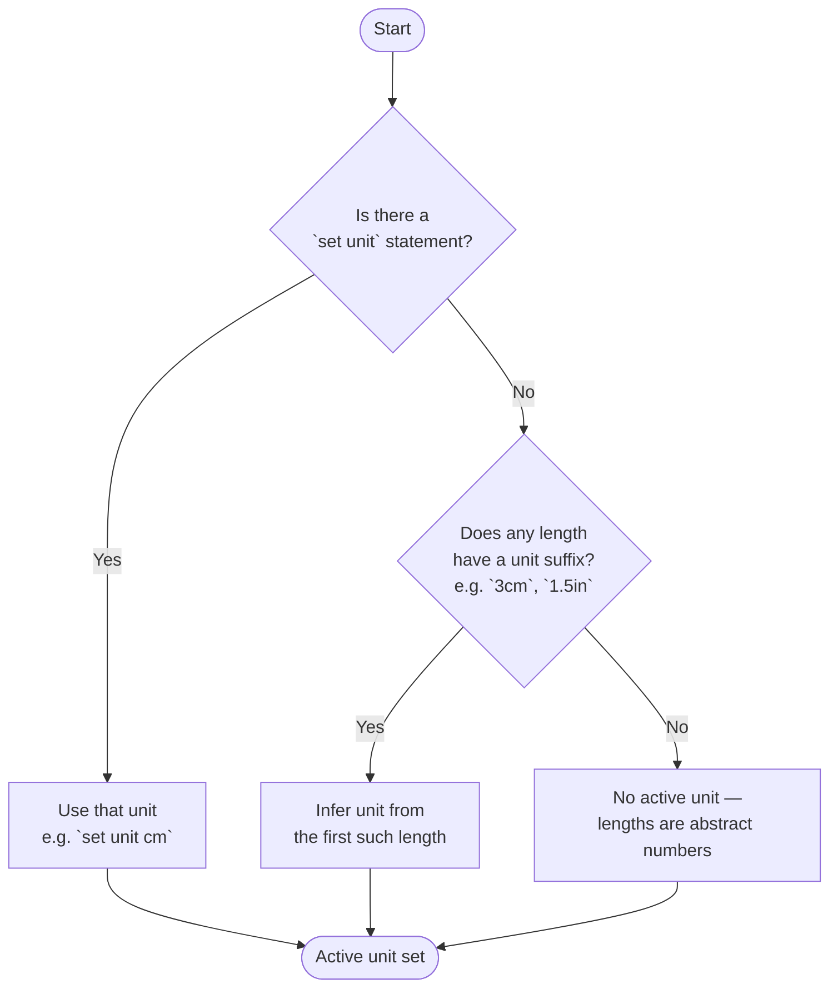

# Pass 0 — Unit Resolution

Before any geometry is processed, the solver determines the **active unit** for the program. This is what gives a bare number like `5` its physical meaning — centimetres, inches, or nothing at all.

## Why a single active unit?

Tilde doesn't track units per-length. There's one active unit for the whole program, and every length is interpreted in that unit. This keeps the constraint model simple and avoids the ambiguity of mixing units mid-program.

## How the active unit is resolved



## The three outcomes

**Explicit unit** — you declared `set unit cm` at the top of the program. Every bare number is in centimetres.

```
set unit cm
let triangle abc = 3, 4, 5
```

**Inferred unit** — no `set unit`, but a length carries a suffix. The solver reads the first suffixed length it encounters and uses that unit for everything.

```
let triangle abc = 3cm, 4cm, 5cm
```

**No unit (abstract)** — no `set unit`, no suffixed lengths. Numbers are dimensionless. This is fine for purely relational geometry where you only care about proportions.

```
let triangle abc = 3, 4, 5
```

## Ordering constraint

`set unit` must appear **before any geometry declaration** in the program. Placing it after a shape, line, or constraint is an error:

```
let segment ab = 5  ← geometry
set unit cm         ← error: too late
```

This is enforced because the unit affects how every length is interpreted, so it must be known before any length is read.
